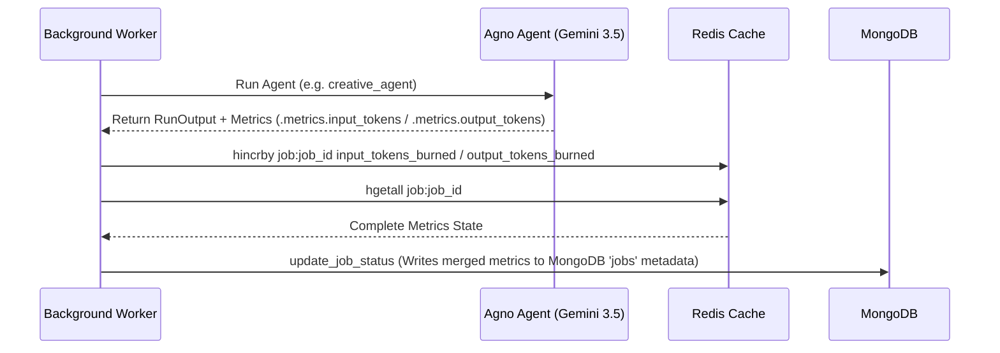

# UGC Video Generation Platform - API Documentation

Welcome to the API Documentation for the UGC Video Generation Platform. This document outlines the backend architecture, full REST API endpoints, real-time Server-Sent Events (SSE) stream, external service connections, and the resource-tracking data structures managed by **Agno**, **Redis**, and **MongoDB**.

---

## 🚀 1. Overview & Base URL

The backend is built with **FastAPI** using asynchronous routing, utilizing **Redis** for pub-sub caching and streaming, and **MongoDB** for long-term historical records and conversation logs.

* **Development Base URL**: `http://localhost:8000`
* **Static Assets Prefix**: `/static` (Mounts local cached outputs, video pieces, and music backings)
* **Production Build Storage**: Files are uploaded directly to the Cloud CDN via [UploadThing](https://uploadthing.com/) with zero permanent storage burden on the FastAPI server.

---

## 💬 2. Interactive Chat & Conversations API

The conversational interface uses these routes to manage the chat stream, load past interactions, and retrieve associated video details.

### A. Main Conversational Endpoint
Sends a message to the **Agno Chat Coordinator Agent** and logs interaction streams.
* **Method**: `POST`
* **Endpoint**: `/api/chat`
* **Request Body** (`application/json`):
  ```json
  {
    "chat_id": "test_session_123",
    "message": "Please generate a video for https://www.calai.app/ with instructions: use a dark starry cosmic theme and put the Giphy centered below captions"
  }
  ```
* **Success Response** (`200 OK`):
  ```json
  {
    "chat_id": "test_session_123",
    "reply": "I've started generating your video! Job ID is 'job_7706fe0e'. I'll analyze CalAI, pick matching stock footage, and compile a premium UGC asset for you.",
    "job_id": "job_7706fe0e"
  }
  ```
* **Behavior Details**:
  - The message is instantly logged to Redis and MongoDB.
  - The conversational context is retrieved from MongoDB and parsed to Gemini 3.5.
  - If a website link is parsed, the agent triggers the `trigger_video_generation` tool, registers a **`PENDING`** job, enqueues the job ID in Redis, and replies with the matching Job ID pattern.

---

### B. Chat Message History
Retrieves historical conversation logs for rendering standard chat bubbles.
* **Method**: `GET`
* **Endpoint**: `/api/chat/history`
* **Query Parameters**:
  - `chat_id` (string, default: `"default_chat"`): Filter messages for this conversation.
* **Success Response** (`200 OK`):
  ```json
  {
    "messages": [
      { "role": "user", "content": "Hello!" },
      { "role": "assistant", "content": "Hey there! I am your premium UGC Video assistant." }
    ]
  }
  ```

---

### C. Retrieve All Conversations
Retrieves a catalog of past sessions, matched with video generation history.
* **Method**: `GET`
* **Endpoint**: `/api/conversations`
* **Success Response** (`200 OK`):
  ```json
  [
    {
      "chat_id": "test_session_123",
      "title": "CalAI Marketing Concept",
      "updated_at": "2026-06-24T14:01:55Z",
      "video_count": 1,
      "videos": [
        {
          "job_id": "job_7706fe0e",
          "status": "COMPLETED",
          "video_url": "https://utfs.io/f/Rl20chDnxW1FuISD9wFP3teuwajbK0FhivDpxRdUA4QqZTz1"
        }
      ]
    }
  ]
  ```

---

### D. Retrieve Single Session
* **Method**: `GET`
* **Endpoint**: `/api/conversations/{chat_id}`
* **Success Response** (`200 OK`):
  ```json
  {
    "chat_id": "test_session_123",
    "title": "CalAI Marketing Concept",
    "messages": [
      { "role": "user", "content": "Generate a video for https://www.calai.app/" },
      { "role": "assistant", "content": "SUCCESS: Video generation initiated! Job ID is 'job_7706fe0e'." }
    ],
    "videos": [
      {
        "job_id": "job_7706fe0e",
        "chat_id": "test_session_123",
        "status": "COMPLETED",
        "progress": 100,
        "message": "Premium UGC Video compiled and served successfully!",
        "product_url": "https://www.calai.app/",
        "video_url": "https://utfs.io/f/Rl20chDnxW1FuISD9wFP3teuwajbK0FhivDpxRdUA4QqZTz1",
        "api_calls_count": 13,
        "input_tokens_burned": 8197,
        "output_tokens_burned": 746,
        "total_tokens_burned": 8943,
        "created_at": "2026-06-24T13:58:12.441Z"
      }
    ]
  }
  ```

---

### E. Delete Conversation
Purges conversational threads and linked operational assets.
* **Method**: `DELETE`
* **Endpoint**: `/api/conversations/{chat_id}`
* **Success Response** (`200 OK`):
  ```json
  {
    "status": "success",
    "message": "Conversation test_session_123 and all related jobs/cache deleted successfully."
  }
  ```

---

## 🛠️ 3. Video Jobs & Metrics Tracking API

These endpoints track progress, display live stages, and detail execution resources.

### A. Fetch Job Operational State
Retrieves full details about a specific video pipeline's status, generated plan, and performance counters.
* **Method**: `GET`
* **Endpoint**: `/api/jobs/{job_id}`
* **Success Response** (`200 OK`):
  ```json
  {
    "job_id": "job_7706fe0e",
    "chat_id": "test_session_123",
    "status": "COMPLETED",
    "progress": 100,
    "message": "Premium UGC Video compiled and served successfully!",
    "product_url": "https://www.calai.app/",
    "custom_instructions": "use a dark starry cosmic theme",
    "video_url": "https://utfs.io/f/Rl20chDnxW1FuISD9wFP3teuwajbK0FhivDpxRdUA4QqZTz1",
    "api_calls_count": 13,
    "input_tokens_burned": 8197,
    "output_tokens_burned": 746,
    "total_tokens_burned": 8943,
    "details": {
      "scraped_stats": {
        "url": "https://www.calai.app/",
        "character_count": 4122,
        "word_count": 590,
        "status": "success"
      },
      "product_brief": {
        "product": "CalAI",
        "category": "Health & Fitness",
        "targetAudience": "Gym-goers, health-conscious individuals",
        "painPoint": "Logging calories manually is exhausting and prone to errors",
        "valueProposition": "Instant, photo-based AI calorie and macro tracking with deep meal analysis"
      },
      "video_plan": {
        "duration": 8,
        "backgroundSearch": "aesthetic flatlay starry space ambient minimal background",
        "isLightBackground": false,
        "gifSearch": "mind blown calorie shock sticker",
        "audioCategory": "funny",
        "fontFamily": "Impact",
        "fontSize": 78,
        "fontColor": "white",
        "strokeColor": "black"
      },
      "rendering_stats": {
        "duration_seconds": 8,
        "resolution": "1080x1920 (Vertical)",
        "codec": "libx264",
        "file_size_mb": 2.14
      }
    }
  }
  ```

---

### B. Real-time Progress Event Stream (SSE)
Opens a persistent Server-Sent Events (SSE) socket channel. Emits real-time state changes as the background worker processes the video.
* **Method**: `GET`
* **Endpoint**: `/api/jobs/{job_id}/sse`
* **Headers**:
  - `Accept`: `text/event-stream`
  - `Cache-Control`: `no-cache`
  - `Connection`: `keep-alive`
* **Response Stream Event Packets**:
  - *Connection Open*:
    ```http
    event: progress
    data: {"job_id": "job_7706fe0e", "status": "ANALYZING_PRODUCT", "progress": 10, "message": "Extracting website landing page text..."}
    ```
  - *Conceptual Phase*:
    ```http
    event: progress
    data: {"job_id": "job_7706fe0e", "status": "GENERATING_CONCEPTS", "progress": 45, "message": "Creative Agent brainstorming viral short-form structures..."}
    ```
  - *Terminal State (Stream Automatically Closes after this)*:
    ```http
    event: progress
    data: {"job_id": "job_7706fe0e", "status": "COMPLETED", "progress": 100, "message": "Premium UGC Video compiled and served successfully!", "video_url": "https://utfs.io/f/Rl20chDnxW1FuISD9wFP3teuwajbK0FhivDpxRdUA4QqZTz1"}
    ```

---

## ⚡ 4. Internal Mechanics & Resource Counters

Resource tracking runs natively in the background worker without degrading compilation speed:

### A. Temporary Redis Keys
All metrics are initially incremented inside Redis hash dictionaries under `job:{job_id}`:
* **`api_calls_count`**: Incremented dynamically whenever an external HTTP client request completes.
* **`input_tokens_burned`**: Aggregates Gemini input tokens.
* **`output_tokens_burned`**: Aggregates Gemini output tokens.
* **`total_tokens_burned`**: Evaluates total token transaction counts.



---

## 🔗 5. External Developers API Footprint

Our pipeline makes a series of deterministic REST/GraphQL queries to these providers:

### A. Website Landing Page Scraper
* **Action**: Crawler executes a clean `GET` request. Strips scripts, styles, metadata, and HTML entities.
* **Redis Counter Effect**: `+1` API call.

### B. Pexels Stock Video Search
* **Endpoint**: `GET https://api.pexels.com/videos/search`
* **Purpose**: Fetches quiet vertical backdrops.
* **Parameters**: `?query={backgroundSearch}&orientation=portrait&per_page=1`
* **Redis Counter Effect**: `+1` API call.

### C. Giphy Transparent Sticker Search
* **Endpoint**: `GET https://api.giphy.com/v1/stickers/search`
* **Purpose**: Searches 5 candidate animated transparent stickers.
* **Parameters**: `?q={gifSearch}&limit=5&rating=g`
* **Redis Counter Effect**: `+1` API call.
* **Multimodal Review Phase**: Down-samples first frames of candidates and calls `giphy_review_agent.run()`. Downloads chosen sticker. `+5` candidate downloads API calls (`+1` per candidate frame downloaded).

### D. Cloud CDN Video Storage (UploadThing)
Once the local FFmpeg container compiles the vertical output, the server runs direct API v7 prepare-and-upload commands:
1. **Endpoint**: `POST https://api.uploadthing.com/v7/prepareUpload`
   - *Payload*: `{"fileName": "ugc_video_job_7706fe0e.mp4", "fileSize": 2244199, "fileType": "video/mp4"}`
   - *Redis Counter Effect*: `+1` API call.
2. **Endpoint**: `PUT {presigned_upload_url}`
   - *Payload*: Direct streaming of mp4 file bytes as multipart.
   - *Redis Counter Effect*: `+1` API call.

---

## 🔒 6. Authorization & Headers

To run local testing queries or integrate your customized client frontend, ensure the following environment variables and keys are specified in your backend server:

| Environment Key | Required For | Format / Sample |
| :--- | :--- | :--- |
| `GOOGLE_API_KEY` | Gemini LLM Agent runs | `AIzaSy...` |
| `PEXELS_API_KEY` | Stock Backdrop searches | `563492ad6f...` |
| `GIPHY_API_KEY` | Sticker Searches | `a1B2c...` |
| `UPLOADTHING_TOKEN` | CDN upload wrapper | `eyJhcGlLZXkiOiJza...` |
| `MONGO_URI` | Chat logs & persistence | `mongodb://localhost:27017` |
| `REDIS_HOST` / `REDIS_PORT` | Real-time PubSub & cache | `localhost` / `6379` |
